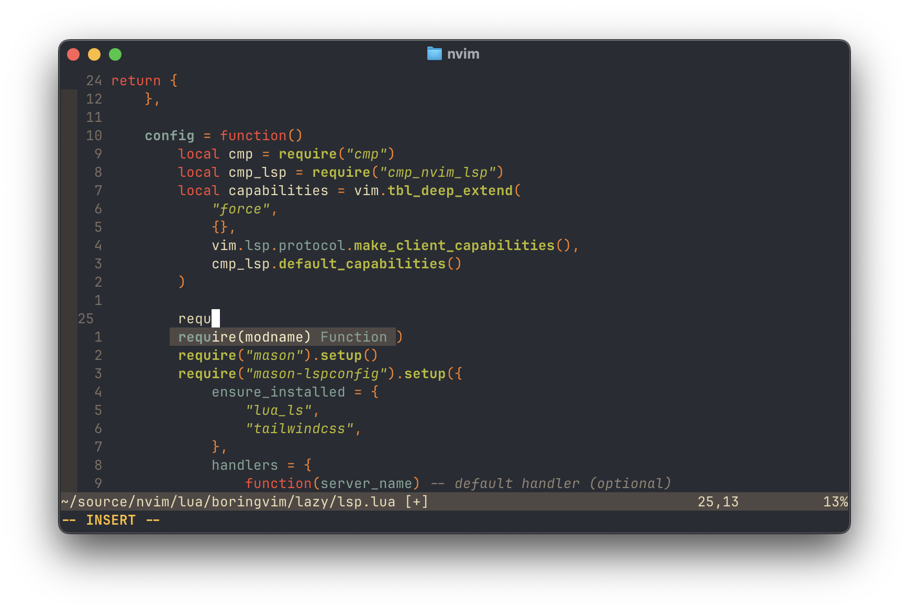
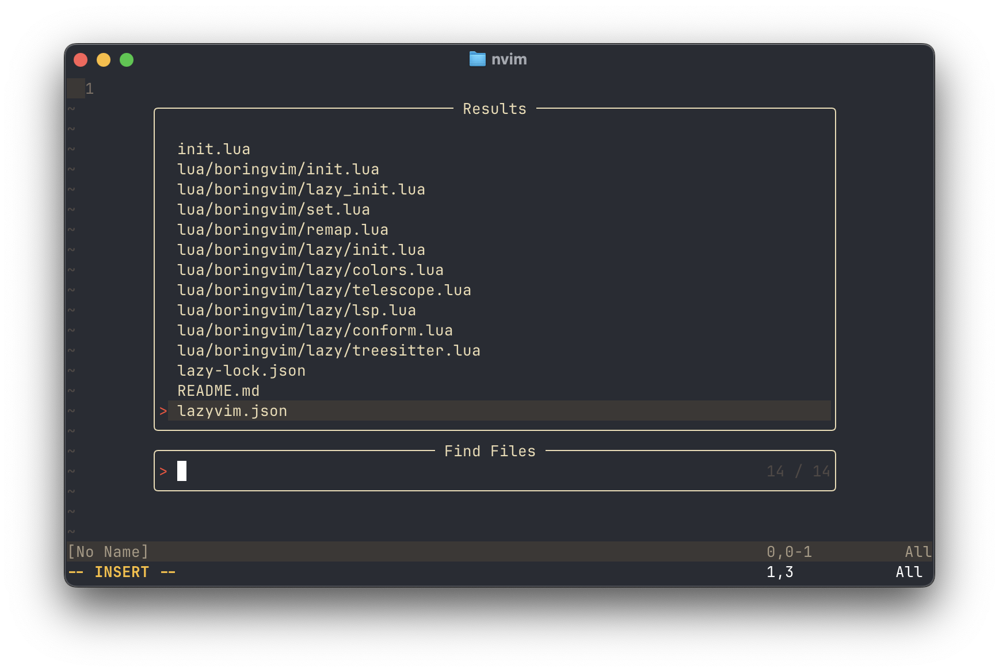

# The Boring Vim

- Hand picked and configured Neovim:
  - Netrw file manager (why not?)
  - Telescope fuzzy finder
  - Lazy.nvim plugin manager
  - LSP + Tree-sitter + Formatter
  - Nice colors


*LSP autocomplete in action*


*Find files quickly with Telescope fuzzy search*

## Installation

1. Say goodbye to Terminal.app, and switch e.g. to
   [Ghostty](https://ghostty.org/) to see colors correctly. (You can
   alternatively delete `colors.lua` if you are happy with NeoVim's default
   colors).

2. Backup your existing Neovim configs

```sh
# required
mv ~/.config/nvim{,.bak}

# optional but recommended
mv ~/.local/share/nvim{,.bak}
mv ~/.local/state/nvim{,.bak}
mv ~/.cache/nvim{,.bak}
```

3. Clone this repo into your neovim configuration folder:

```sh
git clone https://github.com/EskelinenAntti/BoringVim ~/.config/nvim`
```

4. Remove the .git folder, so you can add it to your own repo later:

```sh
rm -rf ~/.config/nvim/.git
```

5. Start Neovim

```sh
nvim
```

